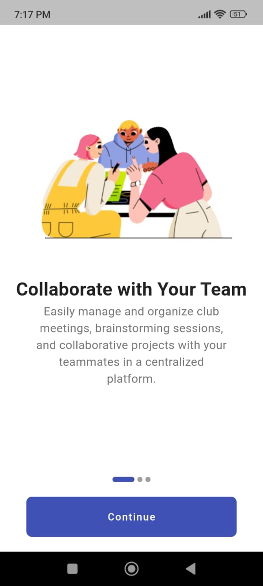
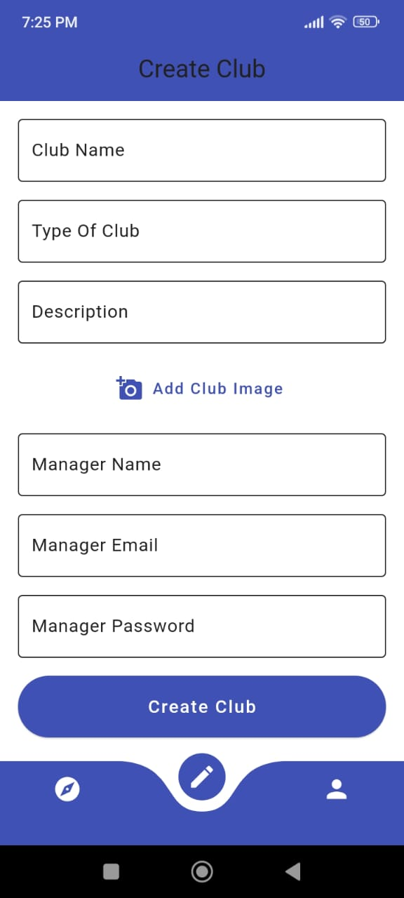

# University Based Advanced Club Management App

## Welcome to Club Hub Readme
Club Hub is a club management app which is designed to solve the issue faced by students , club managers and the administration . A single comprehensive app which caters all the needs.

## What's Special

Role based access control: User's can only access those features which are relevant to them . Based on their roles differnet functionality will be available.

## ScreenShots
Here are just a few screenshots which i took. 

<!-- Table for images -->
<table>
  <tr>
    <td align="center">
      
    </td>
    <td align="center">
      
    </td>
    <td align="center">
      
    </td>
  </tr>
  <tr>
    <td align="center">
      
    </td>
    <td align="center">
      
    </td>
    <td align="center">
      
    </td>
  </tr>
  <tr>
    <td align="center">
      
    </td>
    <td align="center">
      
    </td>
    <td align="center">
      
    </td>
  </tr>
    <tr>
    <td align="center">
      
    </td>
    <td align="center">
      
    </td>
    <td align="center">
      
    </td>
  </tr>
    <tr>
    <td align="center">
      
    </td>
    <td align="center">
      
    </td>
    <td align="center">
      
    </td>
  </tr>

</table>

# Features
- Role-Based Access Control: Users are segmented into Super Admins, Club Managers, and Users, each with specific access and functionalities.
Club Management:
- Super Admins can create and manage clubs.
- Club Managers can create teams, manage applications, and send notifications.
- Users can explore and join clubs, view assigned tasks, and engage in team chats.
- Notifications: Send and receive both general and club-specific notifications, including push notifications.
- Task Management: Club Managers can assign tasks to team members, who can then view and update their progress.
- Profile Management: All users can update their profiles, including changing profile pictures and logging out.
- Real-Time Messaging: Club members can communicate through a chat interface for enhanced collaboration.

# Usage
- Registration and Authentication: Users register and are authenticated, directing them to the appropriate interface based on their role (Super Admin, Club Manager, User).
- Creating and Managing Clubs: Super Admins can create clubs by providing details like the club name, description, type, and image.
- Team Creation and Management: Club Managers can create teams by selecting members and assigning project details. They can also view and 
  manage existing teams.
- Applications Management: Club Managers can review and process student applications to join the club, with options to accept or reject.
- Task Assignment: Club Managers assign tasks to team members, who can view and manage their tasks within the app.
- Sending Notifications: Club Managers can send notifications to all users or specific club members, ensuring everyone stays informed.
- User Interaction: Users can explore clubs, join teams, view tasks, and communicate with teammates through the app's chat feature.
## Video Demo
Check the App out->
https://youtu.be/xQs15ERwH8I

## Installation
Just clone the repository and start running the app your emulator or physical device.

## Tech Stack
- Frontend-> Flutter (Provider state management)
- Backend -> MongoDb, Express.js ,Node.js ,Firebase

  
## Idea 
I have built this app because I saw this issue of lack of exposure to students about the various events happening in the college.